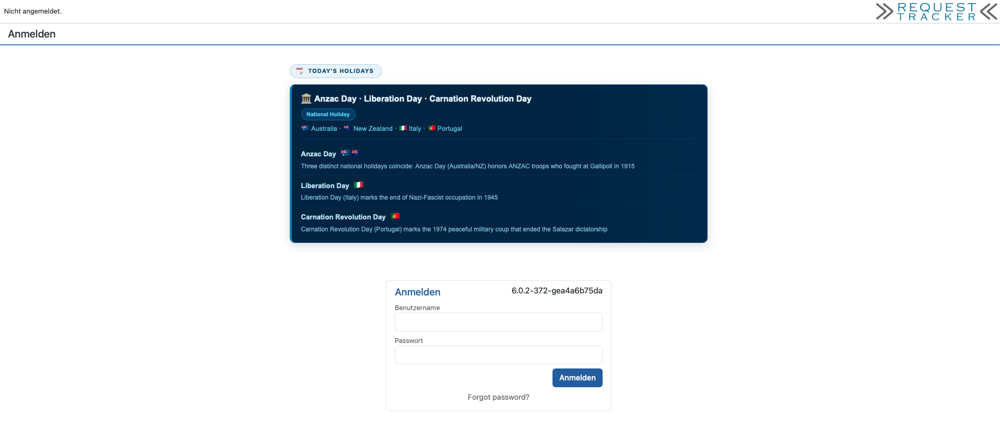

# RT-Extension-Public-Holidays

Displays today's worldwide public holidays on the **RT login page** and as a **dashboard widget**, with country flags, type icons, and descriptions. Supports all RT themes (Elevator light/dark, KN theme, and others) through Bootstrap CSS variables.

## Features

- **Login page banner** — appears automatically above the login form when there are holidays today
- **Dashboard widget** — add *Today's Holidays* to any RT dashboard via the widget picker
- ~280 holidays from 100+ countries: national, religious, cultural, and international observances
- Country flag emoji generated from ISO 3166-1 codes
- Holiday type colour-coding (blue = national, purple = religious, green = cultural, …)
- Same-date holidays consolidated into a single card with per-country sub-entries
- Fully theme-aware: uses Bootstrap 5 CSS variables, looks correct in light and dark mode

## Screenshots

### Login Page 



### Dashboard Widget


## Requirements

- RT 5.0.0 or RT 6.0.x
- Perl 5.10+

## Installation

### 1. Install the Perl module

```bash
perl Makefile.PL
make
sudo make install
```

### 2. Deploy the CSV data file

```bash
sudo cp etc/holidays-worldwide.csv /opt/rt6/local/etc/holidays-worldwide.csv
```

Adjust the destination path to match your `$RT::LocalEtcPath` if it differs.

### 3. Enable the plugin

Add to `/opt/rt6/etc/RT_SiteConfig.pm`:

```perl
Plugin('RT::Extension::PublicHolidays');
```

The `TodaysHolidays` dashboard widget is registered automatically. The login page banner requires no additional configuration.

### 4. Clear Mason cache and restart

```bash
sudo rm -rf /opt/rt6/var/mason_data/obj
sudo systemctl restart apache2   # or your web server
```

### 5. Add the widget to a dashboard (optional)

Open any dashboard → **Edit** → **Add Widget** → select **Today's Holidays**.

## Configuration

All settings go in `RT_SiteConfig.pm`.

### Custom CSV path

```perl
Set($HolidaysCSVPath, '/path/to/your/holidays-worldwide.csv');
```

By default the extension looks for the CSV at `$RT::LocalEtcPath/holidays-worldwide.csv`.

## CSV Format

The data file has five columns:

| Column | Format | Description |
|--------|--------|-------------|
| `Date` | `MM-DD` | Fixed annual date. `MM-DD/DD` matches two consecutive days. `variabel (...)` for lunar/moveable dates (not matched). |
| `Holiday` | text | Holiday name. Multiple holidays on the same date joined with ` · ` (U+00B7). |
| `Countries` | text | Country name(s) separated by ` · `. Must match the built-in ISO 3166-1 name table. |
| `Type` | enum | `National Holiday`, `Religious Holiday`, `Cultural Holiday`, `International Holiday`, `Political Holiday`, `Commemoration`, `Cultural Tradition`, `Regional Holiday`, and combinations thereof. |
| `Description` | text | Free text. For consolidated entries, descriptions are separated by ` · `. |

## Managing Holiday Data

The extension ships with a command-line tool for inspecting and updating the CSV:

```
bin/rt-update-public-holidays [OPTIONS]
```

When RT is installed, the script finds the CSV automatically via `$RT::LocalEtcPath`. When run from a repository checkout it falls back to `etc/holidays-worldwide.csv` relative to itself. Override either with `--csv`.

### `--stats`

Print a summary of the current data file: total entries, number of distinct countries, count per holiday type, and the 20 most-represented countries.

```bash
rt-update-public-holidays --stats
```

### `--validate`

Check the CSV for format problems: missing fields, unexpected date formats, mismatched middle-dot counts in consolidated entries, and exact duplicate rows.

```bash
rt-update-public-holidays --validate
rt-update-public-holidays --validate --csv /opt/rt6/local/etc/holidays-worldwide.csv
```

### `--sort`

Sort all entries by date (`MM-DD`, ascending). Variable-date entries go last. Rewrites the source file in place unless `--output` is specified.

```bash
rt-update-public-holidays --sort
rt-update-public-holidays --sort --output holidays-sorted.csv
```

### `--fetch`

Query the free [Nager.Date API](https://date.nager.at) for a given year and report holidays that are not yet in the CSV. With `--output`, writes a merged file containing both the existing entries and the new ones, sorted by date.

```bash
# See what's new for next year across all ~100 supported countries
rt-update-public-holidays --fetch --year 2027

# Limit to specific countries (ISO 3166-1 alpha-2, comma-separated)
rt-update-public-holidays --fetch --year 2027 --country DE,AT,CH

# Write a merged file ready to review and deploy
rt-update-public-holidays --fetch --year 2027 --output /tmp/holidays-2027.csv
```

No API key is required. Uses only Perl core modules (`HTTP::Tiny`, `JSON::PP`).

### Common options

| Option | Description |
|--------|-------------|
| `--csv FILE` | Read from this CSV file instead of the default |
| `--output FILE`, `-o` | Write result to this file instead of modifying the source |
| `--year YEAR`, `-y` | Year to fetch (default: current year); used with `--fetch` |
| `--country CC,...`, `-c` | Country codes for `--fetch` (default: ~100 countries) |
| `--verbose` | Print additional progress information |
| `--help` | Show full usage |

### Typical update workflow

```bash
# 1. Check current state
rt-update-public-holidays --stats

# 2. Validate for errors
rt-update-public-holidays --validate

# 3. Fetch new holidays into a review file
rt-update-public-holidays --fetch --year 2027 --output /tmp/new.csv

# 4. Review and edit /tmp/new.csv, then deploy
sudo cp /tmp/new.csv /opt/rt6/local/etc/holidays-worldwide.csv
```

No restart is required after updating the CSV — the file is read on every page load.

## Supported Country Names

The extension ships with an ISO 3166-1 lookup table for 120+ country names. If a country name in your CSV is not recognised, no flag is shown for that entry (the holiday is still displayed). Open an issue or pull request to add missing entries.

## Uninstallation

1. Remove `Plugin('RT::Extension::PublicHolidays');` from `RT_SiteConfig.pm`
2. `sudo rm -rf /opt/rt6/local/plugins/RT-Extension-Public-Holidays`
3. `sudo rm -rf /opt/rt6/var/mason_data/obj`
4. Restart the web server

## License

GNU General Public License v2.0 — see [LICENSE](LICENSE).

## Author

Torsten Brumm
